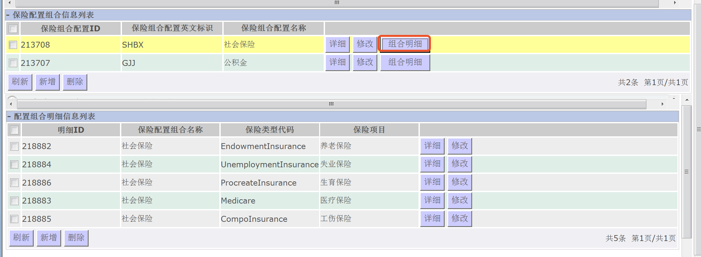

# 1.实施流程梳理与各模块注意点

## 1.数据收集（业务单元梳理提供）

1. 组织机构信息
2. 人员基本信息
3. 分岗位目录信息
4. 岗位价值信息
5. 岗位目录信息
6. 薪酬社保信息
7. 员工配置信息
8. 员工薪酬信息

## 2.组织机构、人员岗位

#### 1.组织机构

菜单：**组织管理-机构业务管理-组织机构信息维护**

操作：选择上级组织机构，点击新增，如下图。

注意点说明：

1.公司4位编码；总部6位，后2位是00；部门8位；科室8位；作业区10位；班组12位。

2.八位编码的部门下面可以建八位编码的科室/车间/分厂。

3.人员需要配置到班组上。

4.因组织机构数据导入逻辑处理复杂，建议下班后操作。

#### 2.人员基本信息

菜单：**实施服务-员工基本信息实施导入**

操作：新增人员选择【工号已存在的不能导入】，更新人员基本信息选择【覆盖更新导入】，如下图。

注意点说明：

1.选择要导入的组织机构总部，再点击导入。

2.人员基本信息导入前确认是否在系统中已经存在（区分新工号导入、覆盖更新。   员工返聘只需激活工号。）

3.在人员基本信息维护好之后最好先维护工作经历。员工配置信息导入后会生成一条工作经历。后面导入工作经历的时候，先检查系统中是否有自动生成的数据，清空工作经历后倒入。

4.工作经历数据时间必须前后衔接，仅留最后一条结束时间为空。

#### 3.分岗位目录

菜单：**实施服务-岗位信息实施导入**

操作：点击第一个【分岗位目录信息初始化导入 】

说明：选择到总部，点击导入

#### 4.薪酬初始化

菜单：**实施服务-薪酬初始化**

操作：选择到总部，点击第一个【初始化计算设置管理区块】 

#### 5.设置岗位价值

1.菜单：**薪酬管理-薪酬基础设置-薪酬参数-岗位价值标准设置**（切换到实施机构的计算管理区）

操作：点击新增

新增完成后，在gird区域中的【岗位工资】行上，点击按钮【岗位价值设置】，然后点击新增，如下图，根据业务单位需求设置岗位价值。

2.菜单：**岗位定员管理-标准设置管理-岗位主价值类型配置**

  菜单：**岗位定员管理/标准设置管理/岗位价值配置** 

#### 6.岗位信息

菜单：**实施服务-岗位信息实施导入**

操作：点击第二个【岗位信息初始化导入 】

注意点说明：

1.选择到总部，点击导入。

2.岗位编码编写不得与其他公司重复，建议前几位用：（G、C、J）+ 公司编码，共15位。

3.岗位信息表中的岗位名称最好不要重复，否则后面做岗位统计不好区分。

#### 7.员工配置信息

 菜单：**实施服务/员工配置信息实施导入**

 操作：点击导入【在岗员工如图一】【离岗人员如图二】

注意点说明：

【模板字段：机构代码、机构名称、人员工号、人员姓名、人员所在岗位名称】

1. 在岗员工配置表：机构代码需写到最底层班组（12位）
2. 由于员工配置模板导出时，系统后台已经被撤销的部门还会出现在机构代码集中，会  出      现员工挂在已撤销机构上的情况导入成功，与标财机构信息数据同步的时候会出现问题，填写模版时需注意
3. 员工配置信息导入后，要反向生成定员
4. 不在岗员工配置表：离岗后管理单位编码不能写到总部，否则无法对该部分人员无法进行奖金发放
5. 导入成功后，要反向生成定员。点击【日常岗位定员数据处理】。

# 2.薪酬管理

#### 1.引用项目实例

菜单：**薪酬管理/薪酬基础设置/薪酬项目/薪酬项目实例**

注意点说明：

1. 发薪单位提供的各类模式、项目、公式必须精确到最小单位。
2. 离岗人员要和在岗人员区分工资总额，薪酬项目不能引用同一个。
3. 薪酬项目实例中计算顺序需按照计算逻辑梳理,否则会出现计算不到项目值的情况。
4. 07模板写项目公式的时候需标好薪酬项目顺序（最好与原始工资单一致，方便薪酬测算等）。
5. 五个专项附加计算顺序全部要是0或者1。
6. 薪酬项目属于其它部分的引用后不能进行BI分类，故不能归进工资总额（如绩效奖预支，其它奖金之类），可以用“预发绩效年薪”类似项目例如进行替换。
7. BI归类中相关扣款项除考勤扣款外均不能进行BI归类，（薪酬项目扣款一属于代扣部分，不能BI归类），导致无法进入工资总额；解决方法：扣款金额（例如其他扣款、扣款1）可以在“其他补发“、“补发1"中进行做补发补扣。

#### 2.引用考勤项目

菜单：**薪酬管理/薪酬基础设置/薪酬项目/考勤项目维护**

说明：

1. 注意是考勤项目单位是天还是小时。

#### 3.引用薪酬参数

菜单：**薪酬管理/薪酬基础设置/薪酬参数/公司薪酬参数**

注意点说明：

1. 薪酬管理-员工参数：不能引用班组长津贴、效益工资、临时翻班津贴、驻外津贴以及带“tax”的相关参数（因为后台有特殊逻辑限制）。
2. 薪酬参数导入后需要进行批量提交操作。
3. 纳税类型：区分交税类别，需要按照规定的格式进行维护（纳税类型需要按照固定的数据进行维护 1 正常纳税 2 残疾人定量减征 3外籍个税附加减除 4列属定量减征 5按比例减征）。
4. 机构参数面向机构内所有员工。
5. 薪酬复制时需要编译公式。

#### 4.编写项目公式

菜单：**薪酬管理/薪酬基础设置/模式公式/项目公式**

说明：

1. 补发补扣维护：需先进行薪酬业务对象授权（补发补扣维护 需先进行薪酬业务对象授权 - 授权关键字）

#### 5.增加薪酬模式

菜单：**薪酬管理/薪酬基础设置/模式公式/薪酬模式**

#### 6.社保福利模块

操作步骤：

1.菜单：**社保福利管理/保险基础设置/保险配置组合**

2.菜单：**社保福利管理/保险标准设置/社会平均工资**

3.菜单：**社保福利管理/保险基础设置/保险项目**

4.菜单：**社保福利管理/员工福利变更管理/福利开户**

5.菜单:   **社保福利管理/员工福利变更管理/年度基数维护**  

#### 7.银行卡维护

操作步骤：

1. 菜单：**薪酬管理/信用卡管理/金融机构维护** 
2. 菜单：**薪酬管理/信用卡管理/卡用途及范围维护**
3. 菜单：**薪酬管理/信用卡管理/信用批量导入** 

注意点说明：

1. 信用卡：支付范围支持多个银行，不支持多个支付方式，每种支付方式只能维护一条记录 。
2. 中行联行号和卡折类型必填，交行卡折类型必填。

#### 8.配置工资单、工资汇总表

1. 菜单:   **薪酬管理/薪酬基础设置/薪酬类别/工资单配置**
2. 菜单：**薪酬管理/薪酬基础设置/薪酬类别/工资汇总表配置**

注意点说明：

1. 工资单配置：在删除一条工资单配置前，需要把所有项目取消分配，否则工资单结果会出现问题。
2. 工资单配置：分配的薪酬项目如果需要系统打印整个工资单，薪酬项目个数不超过28个。
3. 配置工资汇总表最好不要改变五险一金的符号，利于财务抛账。

# 3.系统上线前检查

1. 要打上线标识，否则调动有问题（人会停在公司层）。
2. 打完上线标识，人员不能调到部门层，最好调到总部层或者公司层。
3. 财务模块上线将状态改为【是】，否则财务抛账无法取得数据。

# 4.薪酬复制

1.先初始化计算管理区。

2.复制计算管理区。

3.编译公式。

[http://10.70.248.8/ehr/DispatchAction.do?efFormEname=HRPB9997](http://10.70.248.8/ehr/DispatchAction.do?efFormEname=HRPB9997)

# 5.跨公司调动

1. 备份员工卡号
2. 备份员工参数
3. 日常定员维护